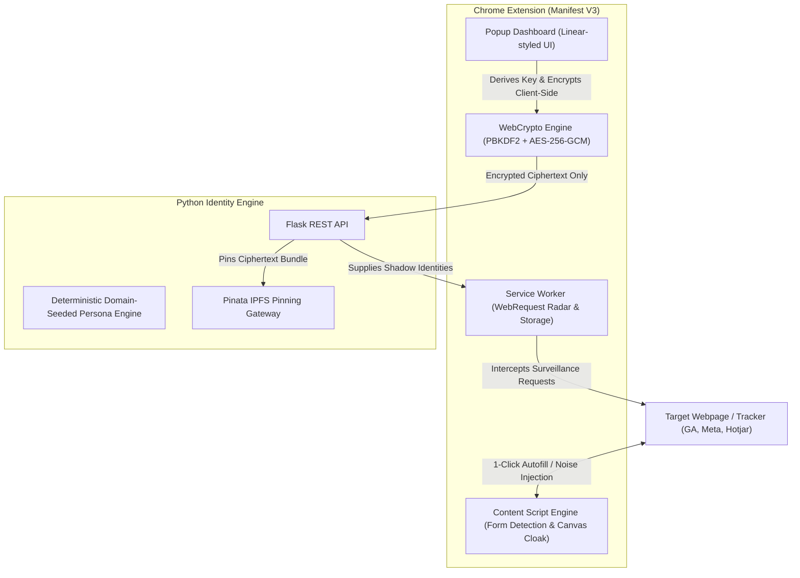

<div align="center">

# 🛡️ Identity Shield (Blocky)
### Decentralized Browser Deception & Anti-Profiling Shadow Identity Engine

[](https://developer.chrome.com/docs/extensions/mv3/intro/)
[](https://developer.mozilla.org/en-US/docs/Web/API/Web_Crypto_API)
[](https://flask.palletsprojects.com/)
[](https://ipfs.tech/)
[](https://www.docker.com/)
[-10b981?logo=pytest&logoColor=white)](https://docs.pytest.org/)

<p align="center">
  <b>Counter-surveillance by design:</b> Instead of merely blocking trackers (which breaks sites and leaves distinct fingerprint gaps), Identity Shield actively poisons surveillance algorithms with synthetic decoy personas, client-side zero-knowledge encryption, and hardware fingerprint cloaking.
</p>

</div>

---

## 📸 Overview & Architecture



---

## 🔥 Key Features

### 1. ⚡ Intelligent 1-Click Form Autofill Engine
* **Universal DOM Heuristics:** Detects form inputs across standard HTML5 and modern reactive Single Page Apps (React, Vue, Angular) via semantic attributes (`autocomplete`, `type`, `aria-label`, placeholder regex).
* **Synthetic Event Dispatch:** Emits simulated user typing (`input`, `change`, `blur`) events to ensure data binding registers across all front-end frameworks.
* **Cyan Highlight Feedback:** Visually illuminates populated fields with an active protection pulse.

### 2. 🌐 Context-Aware Per-Domain Identities
* Dynamically isolates identity profiles per website:
  * `amazon.com` &rarr; Synthetic Identity A
  * `reddit.com` &rarr; Synthetic Identity B
  * `domain-x.com` &rarr; Synthetic Identity C
* Deterministically seeded for consistency while offering 1-click on-demand re-rolls (`🎲`).

### 3. 🔐 Zero-Knowledge Client-Side AES-256-GCM Vault
* **True Zero-Knowledge:** Real personal identifiable information (PII) is encrypted **directly inside your browser** using native `window.crypto.subtle` (PBKDF2 key derivation with 100,000 iterations + AES-256-GCM).
* Plaintext personal data **never leaves the client**.
* Backend and decentralized IPFS only ever receive and pin the encrypted ciphertext bundle.
* Generates verifiable **SHA-256 cryptographic state proofs** for auditability.

### 4. 📡 Real-Time WebRequest Threat Radar
* Inspects network requests in real-time to detect third-party surveillance scripts:
  * **Google Analytics & Tag Manager** *(Analytics & Telemetry)*
  * **Meta / Facebook Pixel** *(Ad Profiling)*
  * **Hotjar / CrazyEgg** *(Session Recording)*
  * **TikTok Pixel & Criteo** *(Ad Retargeting)*
  * **FingerprintJS** *(Device Fingerprinting)*
* Displays active threat badges directly on the browser action toolbar icon.

### 5. 🎭 Canvas Fingerprint Defense Cloak
* Injects mathematical micro-noise into `HTMLCanvasElement.toDataURL` and `CanvasRenderingContext2D.getImageData`.
* Spoofs hardware/GPU rendering signatures so cross-site fingerprinting algorithms cannot track your hardware across browsing sessions.

---

## 📁 Repository Structure

```
Blocky-/
├── IdentityShieldExtension/     # Chrome Extension (Manifest V3)
│   ├── manifest.json            # Extension configuration & permissions
│   ├── background.js            # WebRequest radar & domain persona manager
│   ├── content.js               # In-page autofill & canvas noise cloak
│   ├── crypto.js                # WebCrypto AES-256-GCM & SHA-256 proof engine
│   ├── popup.html               # Minimalist dashboard UI
│   ├── popup.css                # Slate/Indigo executive theme
│   └── popup.js                 # UI coordinator & storage sync
├── identity_engine/             # Python Flask Backend Engine
│   ├── app.py                   # REST API & domain persona synthesizer
│   ├── requirements.txt         # Pinned dependencies
│   ├── Dockerfile               # Production container image
│   └── tests/
│       └── test_engine.py       # Automated test suite
├── docker-compose.yml           # Single-command container orchestration
├── test_form.html               # Interactive verification sandbox
└── README.md                    # Project documentation
```

---

## 🚀 Quickstart Guide

### Option A: Local Setup

1. **Start the Python Identity Engine:**
   ```bash
   cd identity_engine
   python -m venv venv
   # Windows:
   .\venv\Scripts\activate
   # Linux/macOS:
   source venv/bin/activate

   pip install -r requirements.txt
   python app.py
   ```

2. **Load Extension in Chrome:**
   * Open Chrome and navigate to `chrome://extensions/`
   * Enable **Developer mode** (top-right).
   * Click **Load unpacked** and select the `IdentityShieldExtension/` directory.

3. **Verify with Sandbox:**
   * Open `test_form.html` in Chrome to test 1-Click Autofill, Privacy Radar, and Canvas Fingerprint Cloaking.

---

### Option B: Docker Deployment

Run the complete backend engine in an isolated container:
```bash
docker-compose up --build
```
The API will be live at `http://127.0.0.1:5000`.

---

## 🧪 Running Automated Tests

Execute the unit test suite covering persona synthesis, domain consistency, encrypted vault ingestion, and telemetry:

```bash
cd identity_engine
python -m unittest discover tests
```

---

## 💼 LinkedIn Showcase Post Template

```markdown
🚨 We can't stop Big Tech from tracking us—so I built a tool to poison their datasets instead.

Introducing 🛡️ Identity Shield: A Decentralized Browser Deception & Anti-Profiling Engine.

Most privacy tools only try to block trackers, which frequently breaks web applications or leaves identifiable fingerprint gaps. Identity Shield takes a counter-surveillance approach:

🔑 Key Highlights:
1️⃣ Zero-Knowledge Vault: Personal PII is client-side encrypted (AES-256-GCM with 100k PBKDF2 iterations) before decentralized storage on IPFS.
2️⃣ 1-Click Shadow Autofill: In-page DOM heuristics inject synthetic, domain-specific personas into forms across React/Vue/vanilla apps.
3️⃣ Real-Time Threat Radar: Actively monitors and intercepts Google Analytics, Meta Pixel, and Hotjar telemetry with live toolbar counters.
4️⃣ Canvas Fingerprint Cloak: Spoofs HTML5 canvas hardware signatures to disrupt cross-session device tracking.

🛠️ Tech Stack:
• Extension: Chrome Manifest V3, WebCrypto API, Vanilla JS, Modern Minimalist CSS
• Backend: Python, Flask, Faker, IPFS / Pinata
• DevOps & Testing: Docker, Docker Compose, Pytest / Unittest

Check out the repository here: https://github.com/ShreyasTavre/Blocky-

#Cybersecurity #Privacy #WebSecurity #Python #JavaScript #OpenSource #SoftwareEngineering #Docker
```

---

## 📄 License
MIT License &copy; 2026 Shreyas Tavre